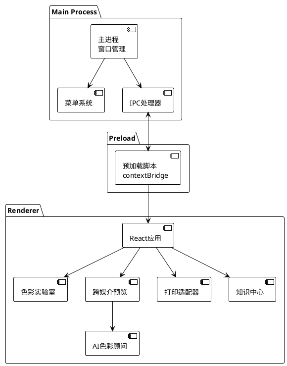
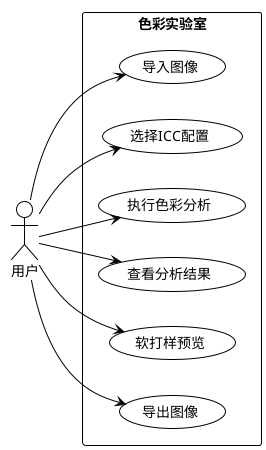
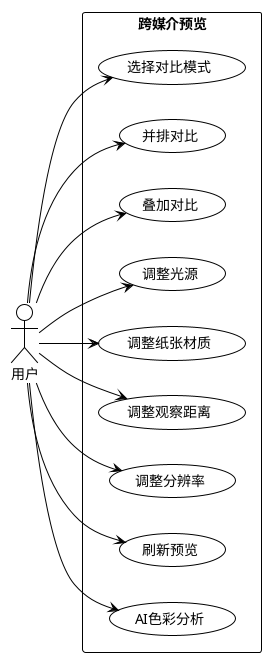
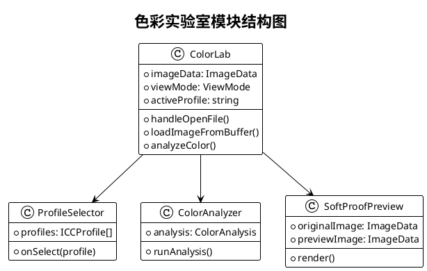
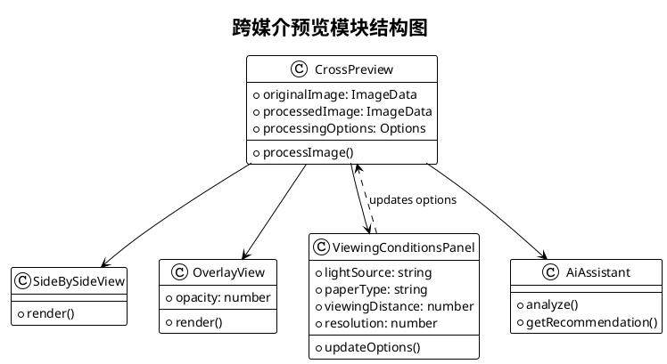
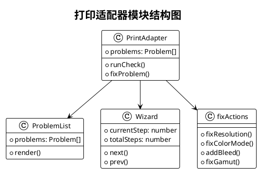
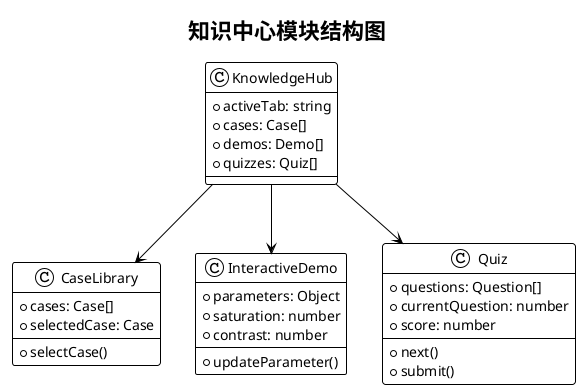
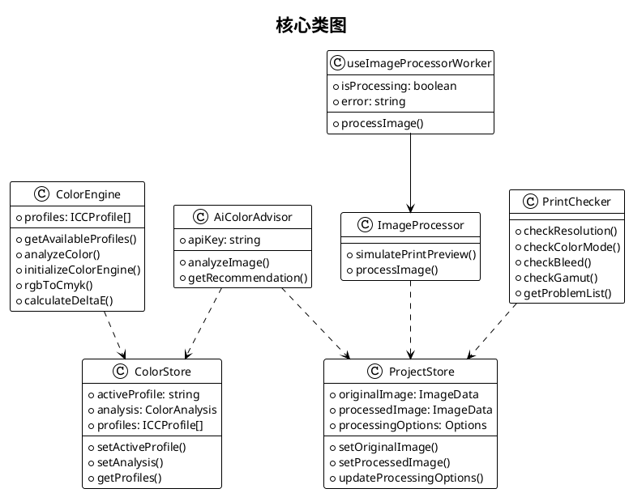
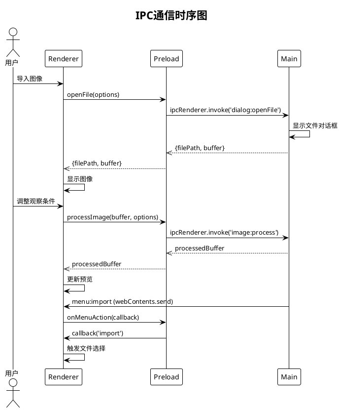

# PrintBridge 开发文档

## 文档信息

| 项目 | 内容 |
|------|------|
| 项目名称 | PrintBridge 色彩管理桌面应用 |
| 文档版本 | v1.0 |
| 创建日期 | 2026-04-29 |
| 文档状态 | 正式发布 |

---

## 目录

1. [引言](#1-引言)
2. [系统架构](#2-系统架构)
3. [需求规格](#3-需求规格)
4. [模块设计](#4-模块设计)
5. [类设计](#5-类设计)
6. [接口设计](#6-接口设计)
7. [流程设计](#7-流程设计)
8. [数据库设计](#8-数据库设计)
9. [部署设计](#9-部署设计)
10. [附录-PlantUML图表代码](#10-附录-plantuml图表代码)

---

## 1. 引言

### 1.1 项目概述

PrintBridge 是一款基于 Electron + React 构建的跨平台桌面应用，旨在桥接数字媒体设计与印刷工程，帮助用户理解色彩管理和印刷工作流程。

**项目背景：**
- 数字设计师在进行印刷输出时经常面临色彩失配问题
- 缺乏对 ICC 色彩配置文件的直观理解和验证工具
- 印刷前的预览和检测流程不够便捷

**核心功能：**
1. **色彩实验室**：支持图像导入、ICC 配置选择、色彩分析、软打样预览
2. **跨媒介预览**：模拟不同光源、纸张材质、观察距离下的印刷效果
3. **智能印刷适配**：检测分辨率、色彩模式、出血区域、色域覆盖等问题
4. **学习资源库**：提供案例分析、交互演示、自测题库
5. **AI色彩顾问**：基于 DeepSeek LLM 提供智能色彩推荐

### 1.2 文档目的

本开发文档旨在：
- 描述 PrintBridge 系统的整体架构和模块设计
- 明确各模块的功能职责和接口关系
- 指导开发人员理解代码结构和实现细节
- 为后续维护和扩展提供参考依据

### 1.3 适用范围

- 开发团队成员：理解系统架构和代码结构
- 测试团队：理解功能需求和测试点
- 运维团队：理解部署和配置要求

---

## 2. 系统架构

### 2.1 总体架构

PrintBridge 采用 Electron 的多进程架构，分为主进程（Main Process）、预加载脚本（Preload）和渲染进程（Renderer）三个部分。

```
┌─────────────────────────────────────────────────────────────┐
│                      Main Process                            │
│  ┌─────────────┐  ┌─────────────┐  ┌─────────────────────┐ │
│  │  窗口管理    │  │   菜单系统   │  │    IPC 处理器       │ │
│  └─────────────┘  └─────────────┘  └─────────────────────┘ │
└─────────────────────────────────────────────────────────────┘
                              ↕ IPC
┌─────────────────────────────────────────────────────────────┐
│                      Preload Script                          │
│              (contextBridge 安全桥接)                         │
└─────────────────────────────────────────────────────────────┘
                              ↕ contextBridge
┌─────────────────────────────────────────────────────────────┐
│                    Renderer Process                          │
│  ┌────────────────────────────────────────────────────────┐ │
│  │                    React Application                   │ │
│  ├──────────┬──────────┬──────────┬──────────┬─────────┤ │
│  │ 色彩实验室 │ 跨媒介预览 │ 打印适配器 │ 知识中心  │AI色彩顾问│ │
│  └──────────┴──────────┴──────────┴──────────┴─────────┘ │
│  ┌──────────┬──────────┬──────────┬──────────┐           │
│  │ ColorStore│ProjectStore│ 状态管理  │  工具函数 │           │
│  └──────────┴──────────┴──────────┴──────────┘           │
└─────────────────────────────────────────────────────────────┘
```

**PlantUML 架构图代码：**



### 2.2 Electron 多进程架构

#### 2.2.1 主进程（Main Process）

主进程是 Electron 应用的入口点，负责：
- 创建和管理 BrowserWindow
- 处理系统菜单
- 处理 IPC 通信
- 管理文件系统操作

**关键文件：** `src/main/index.ts`

```typescript
// 主进程核心功能
- createWindow(): 创建主窗口
- setupMenu(): 配置应用菜单
- setupIpcHandlers(): 注册 IPC 处理函数
```

**主要 IPC 通道：**
| 通道名 | 方向 | 功能 |
|--------|------|------|
| `dialog:openFile` | Main→Renderer | 打开文件对话框 |
| `dialog:saveFile` | Main→Renderer | 保存文件对话框 |
| `fs:readFile` | Main→Renderer | 读取文件内容 |
| `image:process` | Main→Renderer | 图像处理 |
| `menu:*` | Main→Renderer | 菜单动作触发 |

#### 2.2.2 预加载脚本（Preload Script）

预加载脚本在渲染进程创建前注入，用于建立安全的上下文桥接。

**关键文件：** `src/preload/index.ts`

```typescript
// 暴露给渲染进程的 API (window.electronAPI)
- openFile(): Promise<FileResult | null>
- saveFile(data: SaveData): Promise<string | null>
- readFile(path: string): Promise<ArrayBuffer>
- processImage(buffer: ArrayBuffer, options): Promise<ArrayBuffer>
- loadProject(): Promise<ProjectData | null>
- saveProject(data: ProjectData): Promise<boolean>
- onMenuAction(callback: (action: string) => void): void
```

#### 2.2.3 渲染进程（Renderer Process）

渲染进程运行 React 应用，负责 UI 展示和用户交互。

**目录结构：**
```
src/renderer/
├── main.tsx              # React 入口
├── App.tsx               # 根组件
├── components/          # 公共组件
│   └── Layout/
├── modules/             # 功能模块
│   ├── color-lab/       # 色彩实验室
│   ├── cross-preview/   # 跨媒介预览
│   ├── print-adapter/   # 打印适配器
│   └── knowledge-hub/    # 知识中心
├── services/            # 服务层
├── hooks/               # React Hooks
├── store/               # Zustand 状态管理
└── utils/               # 工具函数
```

### 2.3 模块划分

系统包含五个主要模块：

| 模块名称 | 功能描述 | 技术栈 |
|----------|----------|--------|
| 色彩实验室 | 图像导入、ICC配置、色彩分析、软打样 | React + Canvas |
| 跨媒介预览 | 多光源预览、并排/叠加对比 | React + WebWorker |
| 智能印刷适配 | 印刷检测、问题修复向导 | React + Ant Design |
| 学习资源库 | 案例库、交互演示、自测题 | React |
| AI色彩顾问 | DeepSeek LLM 色彩分析 | React + Fetch API |

---

## 3. 需求规格

### 3.1 功能需求

#### 3.1.1 色彩实验室功能需求

| 需求编号 | 功能描述 | 优先级 |
|----------|----------|--------|
| CL-F001 | 支持 PNG、JPG、TIFF、BMP 格式图像导入 | P0 |
| CL-F002 | 列出系统内置 ICC 配置文件 | P0 |
| CL-F003 | 用户可选择 ICC 配置文件 | P0 |
| CL-F004 | 执行色彩分析并显示 ΔE 值 | P0 |
| CL-F005 | 软打样预览（模拟印刷效果） | P0 |
| CL-F006 | 导出处理后的图像（PNG/JPEG/TIFF） | P1 |

**用例图（PlantUML）：**



#### 3.1.2 跨媒介预览功能需求

| 需求编号 | 功能描述 | 优先级 |
|----------|----------|--------|
| CP-F001 | 支持并排对比视图 | P0 |
| CP-F002 | 支持叠加对比视图 | P0 |
| CP-F003 | 调整光源（D50/D65/F） | P0 |
| CP-F004 | 调整纸张材质（铜版纸/胶版纸/新闻纸） | P0 |
| CP-F005 | 调整观察距离（300mm/500mm/1000mm） | P0 |
| CP-F006 | AI 色彩分析和建议 | P1 |

**用例图（PlantUML）：**



#### 3.1.3 智能印刷适配功能需求

| 需求编号 | 功能描述 | 优先级 |
|----------|----------|--------|
| PA-F001 | 检测分辨率（建议 ≥ 300 DPI） | P0 |
| PA-F002 | 检测色彩模式（印刷应为 CMYK） | P0 |
| PA-F003 | 检测出血区域（建议 ≥ 3mm） | P0 |
| PA-F004 | 检测色域覆盖范围 | P0 |
| PA-F005 | 显示问题列表和整体评分 | P0 |
| PA-F006 | 提供问题修复向导 | P1 |

#### 3.1.4 学习资源库功能需求

| 需求编号 | 功能描述 | 优先级 |
|----------|----------|--------|
| KH-F001 | 案例库浏览和筛选 | P1 |
| KH-F002 | 交互式参数演示 | P1 |
| KH-F003 | 自测题库和评分 | P1 |

### 3.2 非功能需求

| 需求类型 | 指标要求 |
|----------|----------|
| 性能 | 图像处理响应时间 < 2秒（4K图像） |
| 性能 | 预览更新延迟 < 300ms |
| 兼容性 | 支持 Windows 10/11 x64 |
| 可用性 | 支持亮色/暗色主题切换 |
| 可用性 | 支持中文/英文界面 |
| 可靠性 | 崩溃后自动恢复工作状态 |

### 3.3 数据流概述

```
用户操作 → React组件 → Zustand Store → 服务层 → IPC → 主进程 → 文件系统
                 ↑                    ↓
                 ←────── 状态更新 ←───┘
```

---

## 4. 模块设计

### 4.1 色彩实验室模块（ColorLab）

#### 4.1.1 模块概述

色彩实验室是 PrintBridge 的核心模块，负责图像的导入、ICC 配置管理、色彩分析和软打样预览。

#### 4.1.2 组件结构

```
ColorLab/
├── ColorLab.tsx          # 主组件，协调子组件
├── ProfileSelector.tsx   # ICC配置文件选择器
├── ColorAnalyzer.tsx     # 色彩分析结果展示
└── SoftProofPreview.tsx  # 软打样预览组件
```

**模块结构图（PlantUML）：**



#### 4.1.3 核心数据结构

```typescript
// ICC配置文件
interface ICCProfile {
  name: string           // 配置名称
  description: string    // 描述信息
  type: 'rgb' | 'cmyk'  // 色彩类型
  isCustom?: boolean    // 是否用户自定义
}

// 色彩分析结果
interface ColorAnalysis {
  representativeColor: RGB
  convertedColor: CMYK
  averageDeltaE: number
  maxDeltaE: number
  isInGamut: boolean
  inGamutPercentage: number
  sampleCount: number
}

// RGB色彩
interface RGB {
  r: number
  g: number
  b: number
}

// CMYK色彩
interface CMYK {
  c: number
  m: number
  y: number
  k: number
}
```

#### 4.1.4 关键算法

**色彩分析算法：**
1. 从图像中采样代表性像素（采样间隔 10px）
2. 使用 LittleCMS WASM 进行色彩转换
3. 计算源色彩空间到目标色彩空间的 ΔE 值
4. 统计色域内/外百分比

**软打样算法：**
1. 创建 ICC Transform（源配置 → 目标配置）
2. 应用观察条件模拟（光源转换）
3. 执行图像转换
4. 渲染到 Canvas

### 4.2 跨媒介预览模块（CrossPreview）

#### 4.2.1 模块概述

跨媒介预览模块用于模拟不同观察条件下的印刷效果，支持并排对比和叠加对比两种模式。

#### 4.2.2 组件结构

```
CrossPreview/
├── CrossPreview.tsx           # 主组件
├── SideBySideView.tsx        # 并排对比视图
├── OverlayView.tsx           # 叠加对比视图
├── ViewingConditionsPanel.tsx # 观察条件面板
└── AiAssistant.tsx            # AI助手面板
```

**模块结构图（PlantUML）：**



#### 4.2.3 观察条件配置

```typescript
// 观察条件选项
interface ViewingConditions {
  lightSource: 'D50' | 'D65' | 'F'  // 标准光源
  paperType: 'coated' | 'uncoated' | 'newsprint'
  viewingDistance: number  // 毫米
  resolution: number      // DPI
}

// 光源特性
const LIGHT_SOURCES = {
  'D50': { x: 0.3457, y: 0.3585, description: '5000K 日光' },
  'D65': { x: 0.3127, y: 0.3290, description: '6500K 日光' },
  'F': { x: 0.4080, y: 0.3940, description: '3000K 白炽灯' }
}
```

### 4.3 智能印刷适配模块（PrintAdapter）

#### 4.3.1 模块概述

智能印刷适配模块负责检测图像的印刷准备度，并提供问题修复向导。

#### 4.3.2 组件结构

```
PrintAdapter/
├── PrintAdapter.tsx       # 主组件
├── ProblemList.tsx       # 问题列表展示
└── Wizard.tsx            # 修复向导
```

**模块结构图（PlantUML）：**



#### 4.3.3 检测项目和标准

| 检测项 | 最低标准 | 警告阈值 | 检测逻辑 |
|--------|----------|----------|----------|
| 分辨率 | 300 DPI | 150 DPI | 图像宽高像素 / 物理尺寸 |
| 色彩模式 | CMYK | RGB | 通道分析 |
| 出血 | 3mm | 1.5mm | 边缘检测 |
| 色域 | 80% 覆盖 | 60% 覆盖 | ICC转换分析 |

### 4.4 学习资源库模块（KnowledgeHub）

#### 4.4.1 模块概述

学习资源库提供印刷色彩管理相关的学习内容，包括案例、演示和自测。

#### 4.4.2 组件结构

```
KnowledgeHub/
├── KnowledgeHub.tsx     # 主组件
├── CaseLibrary.tsx     # 案例库
├── InteractiveDemo.tsx # 交互演示
└── Quiz.tsx            # 自测题库
```

**模块结构图（PlantUML）：**



### 4.5 AI色彩顾问模块（AiAssistant）

#### 4.5.1 模块概述

AI色彩顾问基于 DeepSeek LLM API，为用户提供智能色彩分析和配置建议。

#### 4.5.2 服务架构

```typescript
// AI色彩顾问服务
interface AiColorAdvisor {
  apiKey: string
  analyzeImage(imageData: ImageData): Promise<ColorAdvice>
  getRecommendation(profile: ICCProfile): Promise<string>
}

// 色彩建议
interface ColorAdvice {
  dominantColors: string[]
  recommendedProfile: string
  suggestions: string[]
  confidence: number
}
```

---

## 5. 类设计

### 5.1 核心类图

**核心类图（PlantUML）：**



### 5.2 服务类设计

#### 5.2.1 ColorEngine（色彩引擎）

**文件位置：** `src/renderer/services/color-engine.ts`

```typescript
class ColorEngine {
  private profiles: ICCProfile[]
  private cms: LcmsEngine | null

  // 初始化色彩引擎
  async initializeColorEngine(): Promise<void>

  // 获取可用配置文件列表
  getAvailableProfiles(): ICCProfile[]

  // 分析图像色彩
  async analyzeColor(
    imageData: ImageData,
    sourceProfile: ICCProfile,
    targetProfile: ICCProfile
  ): Promise<ColorAnalysis>

  // RGB 转 CMYK
  rgbToCmyk(rgb: RGB): CMYK

  // 计算 ΔE 值
  calculateDeltaE(color1: LAB, color2: LAB): number
}
```

#### 5.2.2 ImageProcessor（图像处理器）

**文件位置：** `src/renderer/services/image-processor.ts`

```typescript
class ImageProcessor {
  // 模拟印刷预览
  async simulatePrintPreview(
    imageData: ImageData,
    options: ImageProcessorOptions
  ): Promise<ImageData>

  // 处理图像（Web Worker）
  processImage(
    buffer: ArrayBuffer,
    options: WorkerProcessOptions
  ): Promise<ImageData>
}
```

#### 5.2.3 PrintChecker（打印检测器）

**文件位置：** `src/renderer/services/print-checker.ts`

```typescript
class PrintChecker {
  // 检测分辨率
  checkResolution(imageData: ImageData): Problem | null

  // 检测色彩模式
  checkColorMode(imageData: ImageData): Problem | null

  // 检测出血区域
  checkBleed(imageData: ImageData): Problem | null

  // 检测色域
  checkGamut(imageData: ImageData, profile: ICCProfile): Problem | null

  // 获取问题列表
  getProblemList(imageData: ImageData): PrintCheckResult
}
```

### 5.3 状态管理设计（Zustand）

#### 5.3.1 ColorStore

```typescript
interface ColorState {
  activeProfile: string
  analysis: ColorAnalysis | null
  profiles: ICCProfile[]

  setActiveProfile: (profile: string) => void
  setAnalysis: (analysis: ColorAnalysis) => void
  setProfiles: (profiles: ICCProfile[]) => void
}
```

#### 5.3.2 ProjectStore

```typescript
interface ProjectState {
  originalImage: ImageData | null
  processedImage: ImageData | null
  processingOptions: ImageProcessorOptions

  setOriginalImage: (imageData: ImageData) => void
  setProcessedImage: (imageData: ImageData) => void
  updateProcessingOptions: (options: Partial<ImageProcessorOptions>) => void
}
```

---

## 6. 接口设计

### 6.1 IPC通信接口

#### 6.1.1 主进程 IPC 处理器

**文件位置：** `src/main/index.ts`

```typescript
// IPC 通道定义
interface IpcChannels {
  // 文件操作
  'dialog:openFile': () => Promise<FileResult>
  'dialog:saveFile': (data: SaveData) => Promise<string | null>
  'fs:readFile': (path: string) => Promise<ArrayBuffer>

  // 项目操作
  'project:load': () => Promise<ProjectData | null>
  'project:save': (data: ProjectData) => Promise<boolean>

  // 图像处理
  'image:process': (buffer: ArrayBuffer, options: ProcessOptions) => Promise<ArrayBuffer>
}

// 返回数据结构
interface FileResult {
  filePath: string
  buffer: Uint8Array
}
```

#### 6.1.2 预加载 API

**文件位置：** `src/preload/index.ts`

```typescript
// 暴露给渲染进程的 API
interface ElectronAPI {
  openFile(): Promise<FileResult | null>
  saveFile(data: SaveData): Promise<string | null>
  readFile(path: string): Promise<ArrayBuffer>
  processImage(buffer: ArrayBuffer, options: ProcessOptions): Promise<ArrayBuffer>
  loadProject(): Promise<ProjectData | null>
  saveProject(data: ProjectData): Promise<boolean>
  onMenuAction(callback: (action: string) => void): void
}
```

### 6.2 模块间接口

#### 6.2.1 ColorLab 模块接口

```typescript
interface ColorLabProps {
  onImageLoad?: (imageData: ImageData) => void
  onAnalysisComplete?: (analysis: ColorAnalysis) => void
}
```

#### 6.2.2 CrossPreview 模块接口

```typescript
interface CrossPreviewProps {
  originalImage: ImageData
  processedImage?: ImageData
  options?: ViewingConditions
}
```

### 6.3 外部 API 接口

#### 6.3.1 DeepSeek API

```typescript
// AI 色彩分析请求
interface AiAnalyzeRequest {
  image_base64: string
  light_source?: string
  profile_hint?: string
}

// AI 色彩分析响应
interface AiAnalyzeResponse {
  dominant_colors: string[]
  recommended_profile: string
  suggestions: string[]
  confidence: number
}
```

---

## 7. 流程设计

### 7.1 系统总体流程

**流程图（PlantUML）：**

```plantuml
@startuml PrintBridge_系统总体流程图
!theme plain

title 系统总体流程图

start
:启动应用;
:主界面;
if (选择模块) then (色彩实验室)
  :导入图像;
  :选择ICC配置;
  :执行色彩分析;
  :软打样预览;
  :导出结果;
else (跨媒介预览)
  :调整观察条件;
  :生成预览效果;
  :导出结果;
else (打印适配器)
  :运行打印检测;
  if (发现问题?) then (是)
    :运行修复向导;
  endif
  :预览确认;
  :导出印刷;
else (知识中心)
  :学习资源;
  :案例分析;
  :自测测验;
endif
stop

@enduml
```

### 7.2 图像导入流程

```
用户点击导入
    ↓
触发 IPC openFile
    ↓
主进程显示文件对话框
    ↓
用户选择文件/取消
    ↓
返回结果
    ↓
是 → 读取文件 → 解析图像 → 更新状态 → 渲染
否 → 结束（不弹后备对话框）
```

### 7.3 打印检测流程

**流程图（PlantUML）：**


### 7.4 IPC通信时序图

**时序图（PlantUML）：**



---

## 8. 数据库设计

### 8.1 本地存储结构

PrintBridge 使用 Electron Store 进行本地数据持久化。

**存储结构：**

```typescript
interface StoreSchema {
  // 用户偏好设置
  preferences: {
    theme: 'light' | 'dark'
    language: 'zh-CN' | 'en-US'
    defaultModule: ModuleType
  }

  // 项目数据（最近使用的）
  recentProjects: {
    path: string
    lastOpened: string
    thumbnail?: string
  }[]

  // ICC 配置文件缓存
  iccProfiles: {
    name: string
    path: string
    type: 'rgb' | 'cmyk'
  }[]

  // AI 配置
  aiConfig: {
    apiKey: string
    endpoint: string
  }
}
```

### 8.2 持久化策略

| 数据类型 | 存储方式 | 说明 |
|----------|----------|------|
| 用户偏好 | electron-store | 应用设置 |
| 项目文件 | 本地文件 | .printbridge JSON格式 |
| ICC 配置 | 内置 + 用户上传 | 内置 profiles/ |
| 临时数据 | 内存 | 应用关闭时清除 |

### 8.3 项目文件格式

```json
{
  "version": "1.0",
  "originalImage": "base64...",
  "processingOptions": {
    "lightSource": "D50",
    "paperType": "coated",
    "viewingDistance": 500
  },
  "activeProfile": "Coated_FOGRA39",
  "created": "2026-04-29T10:00:00Z"
}
```

---

## 9. 部署设计

### 9.1 打包配置

**打包工具：** electron-builder

**输出格式：**
- Windows: NSIS installer (.exe) + portable (.exe)
- 目录模式: `release/win-unpacked/`

**关键配置：**

```json
{
  "appId": "com.printbridge.app",
  "productName": "PrintBridge",
  "directories": {
    "output": "release"
  },
  "win": {
    "target": ["nsis", "dir"],
    "icon": "build/icon.ico"
  },
  "nsis": {
    "oneClick": false,
    "allowToChangeInstallationDirectory": true
  }
}
```

### 9.2 运行环境

| 环境 | 要求 |
|------|------|
| 操作系统 | Windows 10/11 x64 |
| 内存 | 最低 4GB，推荐 8GB+ |
| 磁盘空间 | 200MB |
| WebView2 | Windows 10 自带，Windows 7 需安装 |

### 9.3 目录结构（打包后）

```
PrintBridge/
├── PrintBridge.exe          # 主程序
├── resources/
│   └── app.asar            # 打包的应用代码
├── locales/                # 国际化资源
└── swiftshader/           # GPU 渲染支持
```

---

## 10. 附录-PlantUML图表代码

### 10.1 系统架构图


### 10.2 色彩实验室模块结构图


### 10.3 跨媒介预览模块结构图


### 10.4 打印适配器模块结构图


### 10.5 知识中心模块结构图


### 10.6 核心类图


### 10.7 系统总体流程图

```plantuml
@startuml PrintBridge_系统总体流程图
!theme plain

title 系统总体流程图

start
:启动应用;
:主界面;
if (选择模块) then (色彩实验室)
  :导入图像;
  :选择ICC配置;
  :执行色彩分析;
  :软打样预览;
  :导出结果;
else (跨媒介预览)
  :调整观察条件;
  :生成预览效果;
  :导出结果;
else (打印适配器)
  :运行打印检测;
  if (发现问题?) then (是)
    :运行修复向导;
  endif
  :预览确认;
  :导出印刷;
else (知识中心)
  :学习资源;
  :案例分析;
  :自测测验;
endif
stop

@enduml
```

### 10.8 打印检测流程图


### 10.9 色彩实验室用例图


### 10.10 跨媒介预览用例图

```plantuml
@startuml PrintBridge_跨媒介预览用例图
!theme plain

left to right direction

actor 用户 as U

rectangle 跨媒介预览 {
  usecase 选择对比模式 as UC1
  usecase 并排对比 as UC2
  usecase 叠加对比 as UC3
  usecase 调整光源 as UC4
  usecase 调整纸张材质 as UC5
  usecase 调整观察距离 as UC6
  usecase 调整分辨率 as UC7
  usecase 刷新预览 as UC8
  usecase AI色彩分析 as UC9
}

U --> UC1
U --> UC2
U --> UC3
U --> UC4
U --> UC5
U --> UC6
U --> UC7
U --> UC8
U --> UC9

@enduml
```

### 10.11 IPC通信时序图

```plantuml
@startuml PrintBridge_IPC通信时序图
!theme plain

title IPC通信时序图

actor 用户 as U
participant Renderer as R
participant Preload as P
participant Main as M

U -> R : 导入图像
R -> P : openFile(options)
P -> M : ipcRenderer.invoke('dialog:openFile')
M -> M : 显示文件对话框
M -->> P : {filePath, buffer}
P -->> R : {filePath, buffer}
R -> R : 显示图像

U -> R : 调整观察条件
R -> P : processImage(buffer, options)
P -> M : ipcRenderer.invoke('image:process')
M -->> P : processedBuffer
P -->> R : processedBuffer
R -> R : 更新预览

M -> R : menu:import (webContents.send)
R -> P : onMenuAction(callback)
P -> R : callback('import')
R -> R : 触发文件选择

@enduml
```

---

## 文档版本历史

| 版本 | 日期 | 作者 | 变更内容 |
|------|------|------|----------|
| 1.0 | 2026-04-29 | PrintBridge Team | 初始版本 |