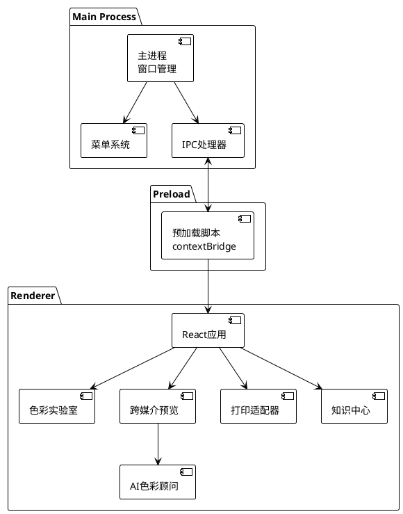
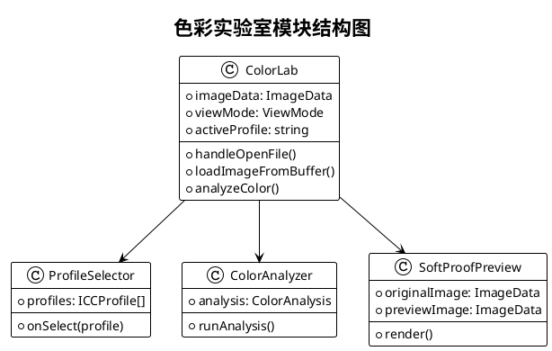
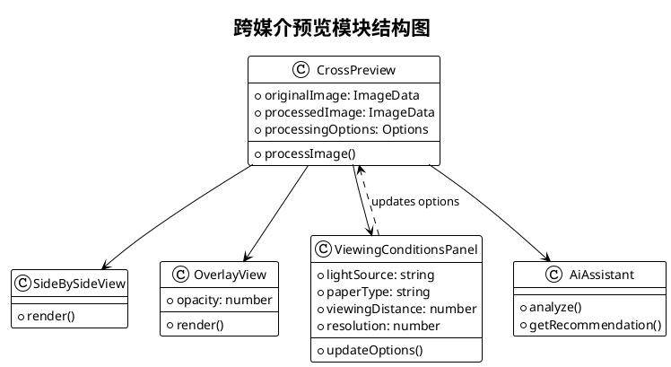
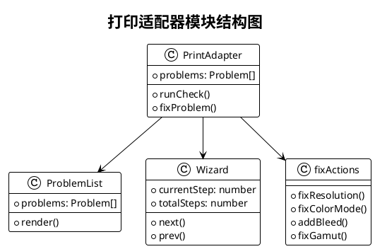
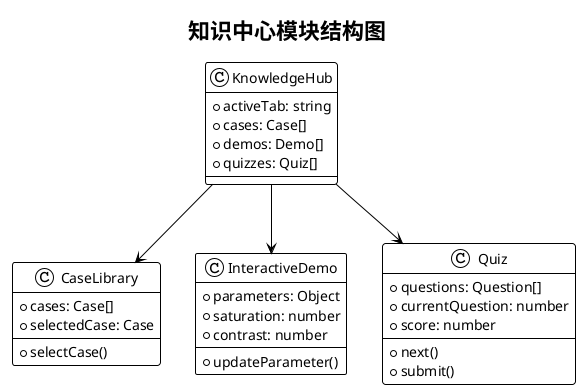
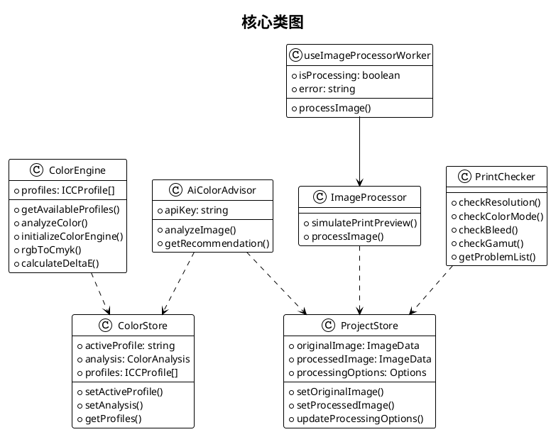
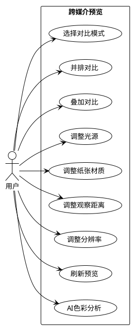
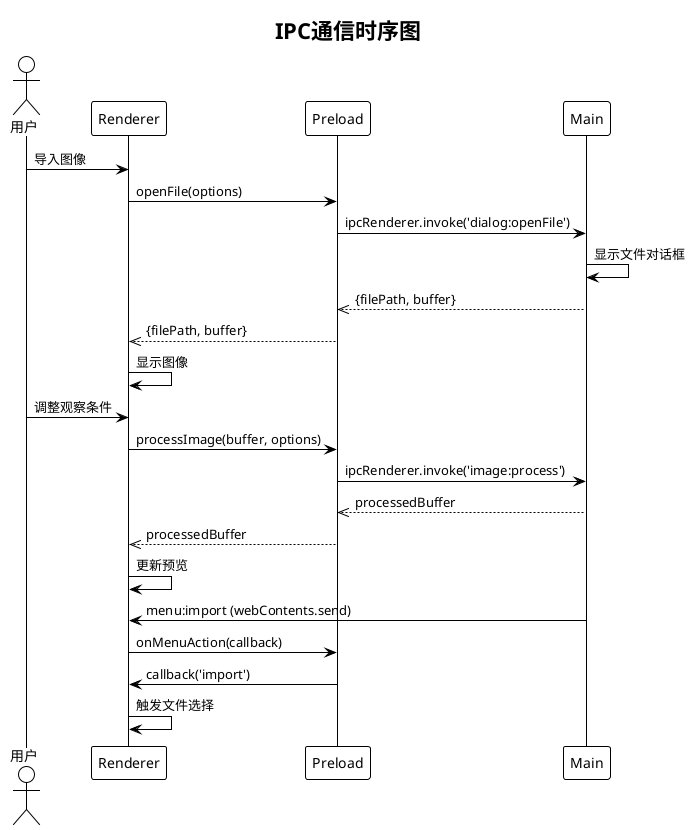

# PrintBridge PlantUML 图表代码

本文档包含 PrintBridge 开发文档中所有图表的 PlantUML 源代码。

---

## 目录

1. [系统架构图](#1-系统架构图)
2. [色彩实验室模块结构图](#2-色彩实验室模块结构图)
3. [跨媒介预览模块结构图](#3-跨媒介预览模块结构图)
4. [打印适配器模块结构图](#4-打印适配器模块结构图)
5. [知识中心模块结构图](#5-知识中心模块结构图)
6. [核心类图](#6-核心类图)
7. [系统总体流程图](#7-系统总体流程图)
8. [打印检测流程图](#8-打印检测流程图)
9. [色彩实验室用例图](#9-色彩实验室用例图)
10. [跨媒介预览用例图](#10-跨媒介预览用例图)
11. [IPC通信时序图](#11-ipc通信时序图)

---

## 1. 系统架构图



---

## 2. 色彩实验室模块结构图



---

## 3. 跨媒介预览模块结构图



---

## 4. 打印适配器模块结构图



---

## 5. 知识中心模块结构图



---

## 6. 核心类图



---

## 7. 系统总体流程图

```plantuml
@startuml PrintBridge_系统总体流程图
!theme plain

title 系统总体流程图

start
:启动应用;
:主界面;
if (选择模块) then (色彩实验室)
  :导入图像;
  :选择ICC配置;
  :执行色彩分析;
  :软打样预览;
  :导出结果;
else (跨媒介预览)
  :调整观察条件;
  :生成预览效果;
  :导出结果;
else (打印适配器)
  :运行打印检测;
  if (发现问题?) then (是)
    :运行修复向导;
  endif
  :预览确认;
  :导出印刷;
else (知识中心)
  :学习资源;
  :案例分析;
  :自测测验;
endif
stop

@enduml
```

---

## 8. 打印检测流程图


---

## 9. 色彩实验室用例图


---

## 10. 跨媒介预览用例图



---

## 11. IPC通信时序图



---

## 使用说明

### 在线编辑器

1. 访问 [PlantUML Online Editor](http://www.plantuml.com/plantuml/uml/)
2. 粘贴上述代码
3. 点击 "Render" 生成图表
4. 右键保存为 PNG/SVG

### 本地生成

安装 PlantUML 后，使用以下命令：

```bash
# 生成单个图表
plantuml diagram.puml

# 生成所有图表
plantuml *.puml

# 指定输出格式
plantuml -Tpng diagram.puml
plantuml -Tsvg diagram.puml
```

### VS Code 插件

安装 "PlantUML" 插件后：
1. 打开 `.puml` 文件
2. 按 `Alt+D` 预览
3. 按 `Ctrl+Shift+P` → "PlantUML: Export Current Diagram" 导出

---

*文档生成时间: 2026-04-29*